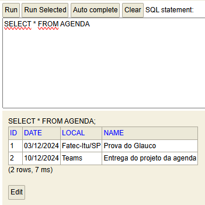
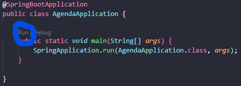
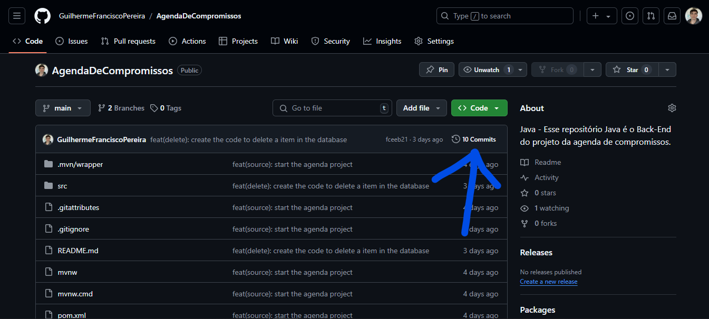
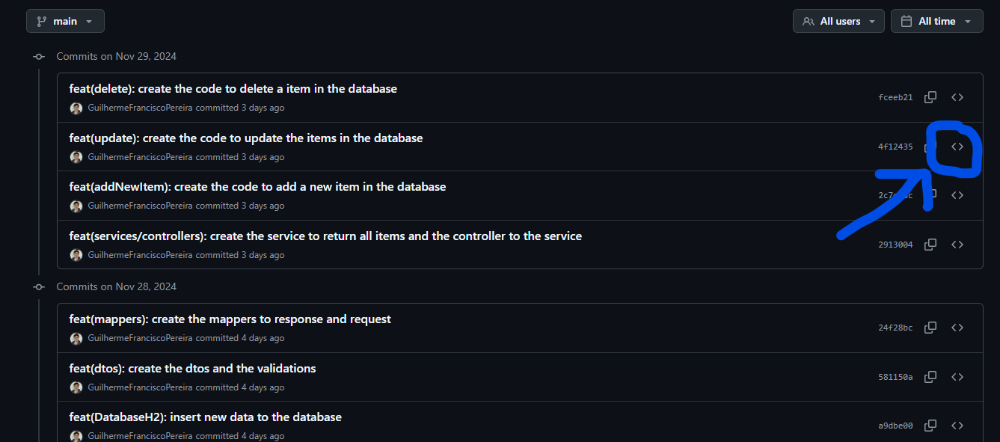
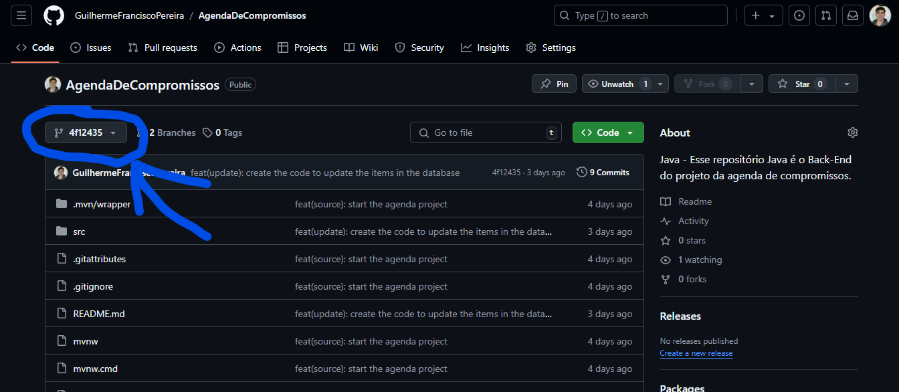

# 📅 Java Project - Agenda de compromissos 📅

## 📌 Sobre o projeto

### Esse repositório Java é o Back-End do projeto da agenda de compromissos.

> 🎓 Projeto proposto na faculdade Fatec Itu/SP.

> 👨‍🏫 Projeto proposto pelo professor: Glauco Toledo.

## 🧠 Critérios de Avaliação
- ✔️ Utilizar o banco de dados H2
- ✔️ Mostrar todos os compromissos que existem na agenda
- ✔️ Adicionar novos compromissos
- ✔️ Editar um compromisso
- ✔️ Deletar um compromisso

##

# 

## 🖥️ H2 console:


##

#

## 🖥 Tecnologias Utilizadas
<div align='center'>


</div>

## 🙋🏻‍♂ Como me localizar no projeto?

### Todos os arquivos de código fonte do projeto estão em: `./src/main`

## 🛈 Como o projeto está estruturado

- `./src/main/resources:` Na pasta resources é o onde vamos armazenar arquivos e recursos que não são diretamente parte do código-fonte (como classes Java) e também é onde temos guardado o nosso arquivo que está ligado diretamente com meu banco de dados `data.sql`.

- `./src/main/java/com/appointmentAgenda/agenda/controllers:` Contém as classes responsáveis por gerenciar as requisições HTTP. É por onde nós vamos receber e processar requisições, chamar a lógica de negócios na camada de serviço, e retornar respostas.

- `./src/main/java/com/appointmentAgenda/agenda/dtos:` Nesta pasta temos os objetos que são usados para transferir dados entre diferentes camadas da aplicação.

- `./src/main/java/com/appointmentAgenda/agenda/entities:` Onde fica as entidades do domínio, que representam os objetos, também é mapeado para o banco de dados e contêm os atributos que a aplicação manipula.

- `./src/main/java/com/appointmentAgenda/agenda/mappers:` Aqui existe as classes responsáveis por realizar a conversão entre objetos de diferentes camadas. Por exemplo, um mapper pode ser usado para transformar uma entidade em um DTO ou vice-versa. Essas classes são importantes para separar a lógica de transformação de dados e evitar que a conversão ocorra diretamente nos controllers ou services.

- `./src/main/java/com/appointmentAgenda/agenda/repositories:` Contém as interfaces e classes responsáveis pela interação com o banco de dados.

- `./src/main/java/com/appointmentAgenda/agenda/services:` Onde fica os nossos serviços, e também onde está manipulando dados e interagindo com os repositórios para persistir ou recuperar informações do banco de dados.

- `./src/main/java/com/appointmentAgenda/agenda/AgendaApplication.java:` Esta é a classe principal de inicialização do projeto, é onde está o nosso método main que inicia o contexto da aplicação e configura o ambiente.

- `./src/assets:` Onde está todas as fotos e arquivos estáticos que vão ser usadas no projeto.


## ❔ Como rodar o projeto na minha máquina?

- Antes de tudo, você precisa ter o Git instalado no seu computador. O Git é uma ferramenta que permite clonar e gerenciar repositórios de código.
    - Windows: Baixe o Git <a href="https://git-scm.com/download/win" target="_blank">aqui</a> e siga as instruções de instalação.
    - macOS: Você pode instalar o Git <a href="https://git-scm.com/download/mac" target="_blank">aqui</a> ou usando o Homebrew com o comando brew install git:
        ```bash
        brew install git
        ```
        
    - Linux: Use o gerenciador de pacotes da sua distribuição, por exemplo para Debian/Ubuntu:
        ```bash
        sudo apt install git
        ```
        
- Além do git você também dever ter o Java, primeiro descubra se tem o java e se não tiver siga o passo a passo abaixo para instalar. 
    1. No Windows
        Pressione Windows + R, digite cmd e pressione Enter.
        Digite o seguinte comando e pressione Enter:

        ```
        java -version
        ```
        Se o Java estiver instalado, você verá algo como:

        ```
        java version "1.8.0_261"
        Java(TM) SE Runtime Environment (build 1.8.0_261-b12)
        Java HotSpot(TM) 64-Bit Server VM (build 25.261-b12, mixed mode)
        ```
        Se não estiver instalado, você verá uma mensagem indicando que o comando não é reconhecido, como:

        ```
        'java' não é reconhecido como um comando interno ou externo
        ```

        Então instale o java jdk por aqui: 
        > <a href="https://download.oracle.com/java/23/latest/jdk-23_windows-x64_bin.msi" target="_blank">https://download.oracle.com/java/23/latest/jdk-23_windows-x64_bin.msi</a>
        
    2. No Linux
        Abra o Terminal.

        Digite o seguinte comando e pressione Enter:

        ```   
        java -version
        ```

        Se o Java estiver instalado, você verá a versão do Java, como:

        ```
        openjdk version "11.0.10" 2021-01-19
        OpenJDK Runtime Environment (build 11.0.10+9)
        OpenJDK 64-Bit Server VM (build 11.0.10+9, mixed mode)
        ```

        Se o Java não estiver instalado, você verá uma mensagem indicando que o comando não foi encontrado:

        ```
        comando não encontrado: java
        ```

        Instale o java por aqui:
        > <a href="https://download.oracle.com/java/23/latest/jdk-23_linux-x64_bin.rpm" target="_blank">https://download.oracle.com/java/23/latest/jdk-23_linux-x64_bin.rpm</a>

    3. No macOS
        Abra o Terminal:

        Você pode abrir o Terminal pelo Finder: Aplicativos > Utilitários > Terminal.
        Digite o seguinte comando e pressione Enter:

        ```
        java -version
        ```
        Se o Java estiver instalado, você verá algo como:

        ```
        java version "1.8.0_261"
        Java(TM) SE Runtime Environment (build 1.8.0_261-b12)
        Java HotSpot(TM) 64-Bit Server VM (build 25.261-b12, mixed mode)
        ```

        Se o Java não estiver instalado, o macOS pode sugerir a instalação do Java com uma mensagem como:

        ```
        No Java runtime present, requesting install.
        ```

        Mas você também pode instalar por aqui:
        > <a href="https://download.oracle.com/java/23/latest/jdk-23_macos-x64_bin.dmg" target="_blank">https://download.oracle.com/java/23/latest/jdk-23_macos-x64_bin.dmg</a>

- Agora com o git e o java no seu computador vamos acessar o código, para isso abra o terminal do seu computador (no Windows, você pode usar o Git Bash, que é instalado junto com o Git).

- Navegue até o diretório onde deseja armazenar o projeto.

- Execute o comando para clonar o repositório:

    ```bash
    git clone https://github.com/GuilhermeFranciscoPereira/AgendaDeCompromissos_BackEnd.git
    ```
    
- Após clonar o repositório, navegue até a pasta do projeto
    ```bash
    cd AgendaDeCompromissos_BackEnd
    ```
    
- Agora você pode abrir os arquivos do projeto com seu editor de texto ou IDE preferido. Exemplo do vsCode: 
    ```bash
    code .
    ```

- Para começar você deve ir: "src" > "main" > "java" > "com" > "appointmentAgenda" > "agenda" > "AgendaApplication.java" > Apertar em 'run' onde a foto a baixo mostra:


- Pronto! Todo o Back-End estará funcionado na sua máquina. Porém, caso precise de alguma ajuda em algo entre em contato comigo pelo meu LinkedIn: https://www.linkedin.com/in/guilherme-francisco-pereira-4a3867283

## ⚠️ Informações importantes sobre o projeto ⚠️

### Todos os commits do projeto possuem um readme detalhado do que foi feito naquele commit, então caso deseje ver o processo de criação do código viaje pelos commits e veja as informações!

### Como fazer isso? 

#### Para você ver o processo de criação e o que foi feito em cada commit siga o passo-a-passo:

#### Primeiro: Nessa guia em que você está, suba a tela até encontrar embaixo do botão verde um local igual o da foto abaixo e então clique nele


#### Segundo: No lado direito dos commits você encontra clique no simbolo de <> como está na foto e então você irá encontrar como o código estava naquele momento e o readme detalhado daquele momento!


#### Terceiro: Depois de encontrar tudo que deseja, caso queira voltar para cá, você irá clicar no local em que a imagem a baixo mostra:


#### E então clique em main e voltará para cá!

##

## 🎉 É isso! Esse foi o nosso Back-End, caso tenha ficado com alguma dúvida ou deseje complementar algo diretamente comigo você pode estar entrando em contato através do meu LinkedIn:
> Link do meu LinkedIn: <a href="https://www.linkedin.com/in/guilherme-francisco-pereira-4a3867283" target="_blank">https://www.linkedin.com/in/guilherme-francisco-pereira-4a3867283</a>

### 🚀 Obrigado pela atenção e espero que tenha gostado do que tenha visto aqui, que tal agora dar uma olhada nos meus outros repositórios? 👋🏻

#

### ❤️ Créditos:

- #### Créditos dos emojis: 
> <a href="https://emojipedia.org" target="_blank">https://emojipedia.org</a>

- #### Créditos ao professor que propos o projeto: 
> <a href="https://github.com/glaucotodesco" target="_blank">https://github.com/glaucotodesco</a>