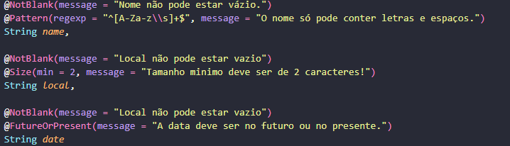

# ☕ Java Project - Agenda de compromissos ☕

## Esse projeto Java é o Back-End do projeto da agenda de compromissos.

> 🎓 Projeto proposto na faculdade Fatec Itu/SP.

> 👨‍🏫 Projeto proposto pelo professor: Glauco Toledo.

> Commit: 28/11/2024 - 16:56 ( Criação do arquivo para os serviços e criação das dtos )

## Services:
### Criado a pasta e o arquivo para os serviços, mas está vazio por enquanto.

## Dtos:
### Criado a pasta para as Dtos e os dois arquivos, tanto o request quando o response.
### No request foi feito as validações, como não pode ser em branco, tamanho mínimo e etc.
### Foto de como está as validações:

#

## ❤️ Créditos:

### 🎉 Créditos dos emojis:
> 🔗 https://emojipedia.org