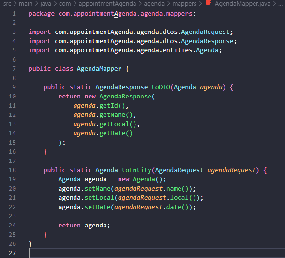

# ☕ Java Project - Agenda de compromissos ☕

## Esse projeto Java é o Back-End do projeto da agenda de compromissos.

> 🎓 Projeto proposto na faculdade Fatec Itu/SP.

> 👨‍🏫 Projeto proposto pelo professor: Glauco Toledo.

> Commit: 28/11/2024 - 17:14 ( Criação dos mappers )

## Mapper:
### Mappers criado, já realizado o mapper tanto para o response quanto para o request. Foto do código:

#

## ❤️ Créditos:

### 🎉 Créditos dos emojis:
> 🔗 https://emojipedia.org