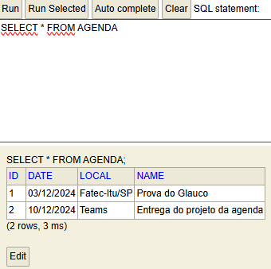

# ☕ Java Project - Agenda de compromissos ☕

## Esse projeto Java é o Back-End do projeto da agenda de compromissos.

> 🎓 Projeto proposto na faculdade Fatec Itu/SP.

> 👨‍🏫 Projeto proposto pelo professor: Glauco Toledo.

> Commit: 28/11/2024 - 15:41 ( Criação dos repositórios e adição dos dados do banco h2 )

## Repositories:
### Criado a pasta repositories e o arquivo AgendaRepository.java. Onde nesta primeira versão temos apenas a criação e adicionado o Extends para o JpaRepository.

## Banco H2 funcionado:

#

## ❤️ Créditos:

### 🎉 Créditos dos emojis:
> 🔗 https://emojipedia.org