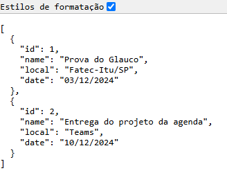

# ☕ Java Project - Agenda de compromissos ☕

## Esse projeto Java é o Back-End do projeto da agenda de compromissos.

> 🎓 Projeto proposto na faculdade Fatec Itu/SP.

> 👨‍🏫 Projeto proposto pelo professor: Glauco Toledo.

> Commit: 29/11/2024 - 15:25 ( Criação da função de buscar por todos os itens do banco de dados )

## controllers:
### criado os controllers para fazer funcionar o serviço que retorna todos os itens do banco de dados

## services:
### Criado de fato o serviço que retorna todos os itens do banco de dados, um exemplo dele funcionando e retornando:

#

## ❤️ Créditos:

### 🎉 Créditos dos emojis:
> 🔗 https://emojipedia.org